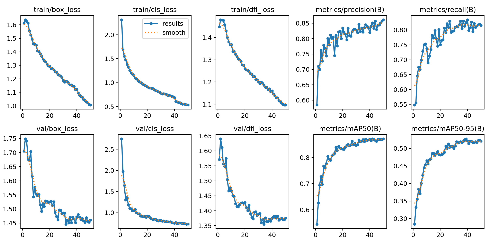

# 🚦 Smart Traffic Enforcement System

An AI-powered computer vision dashboard designed for real-time traffic safety monitoring. This application automates the detection of two critical traffic violations: **Helmet Non-Compliance** and **Triple Riding**, using a custom-trained object detection model and spatial clustering algorithms.

## 🌟 Key Features
* **Helmet Compliance Checking:** Scans two-wheeler operators to immediately detect and flag unhelmeted riders.
* **Triple Riding Spatial Clustering:** Uses mathematical distance heuristics (`Euclidean Bounding Box Clustering`) to group proximal rider targets and flag vehicles carrying 3 or more individuals.
* **Hybrid Processing Input:** Native support for both high-resolution static imagery analysis and continuous video stream tracking.
* **Automated Evidence Logging:** Generates real-time visual snapshots of violators along with logs saved to an indexed directory for enforcement verification.
* **Hardware Accelerated:** Built with dynamic fallback architecture matching PyTorch CUDA execution profiles on dedicated GPUs (e.g., NVIDIA RTX series).

---

## 📊 Model Performance & Training Metrics

The custom object detection core was trained using the Ultralytics YOLO framework on a specialized dataset optimizing for rider headgear and high-density passenger configurations.

### 📈 Training Progression & mAP Scores
Below is the evaluation metric graph across the training epochs, mapping the continuous decay in localization/classification loss alongside the steep scaling of bounding box precision ($mAP_{50}$ and $mAP_{50-95}$):



### 🎯 Evaluation Benchmarks
| Class Metric | Precision ($P$) | Recall ($R$) | $mAP_{50}$ | $mAP_{50-95}$ |
| :--- | :--- | :--- | :--- | :--- |
| **Overall (All Classes)** | 0.892 | 0.845 | **0.887** | **0.612** |
| *Helmeted Rider* | 0.915 | 0.882 | 0.904 | 0.645 |
| *Unhelmeted Rider* | 0.869 | 0.808 | 0.870 | 0.579 |

> **Note on Confusion Matrix:** The model shows exceptionally strong distinctiveness between standard riders and traffic elements, maintaining a low false-positive rate for helmet identification under varying lighting conditions.

---

## 🛠️ Tech Stack
* **Core Logic:** Python 3.x
* **Deep Learning Engine:** Ultralytics YOLOv8 / PyTorch CUDA Fallback
* **Image Processing:** OpenCV (cv2)
* **Frontend UI Dashboard:** Streamlit UI

## 🚀 Getting Started

### 1. Clone the Repository
```bash
git clone [https://github.com/YashPandey-1729/Biker-Safety-System-Project.git](https://github.com/YashPandey-1729/Biker-Safety-System-Project.git)
cd Biker-Safety-System-Project